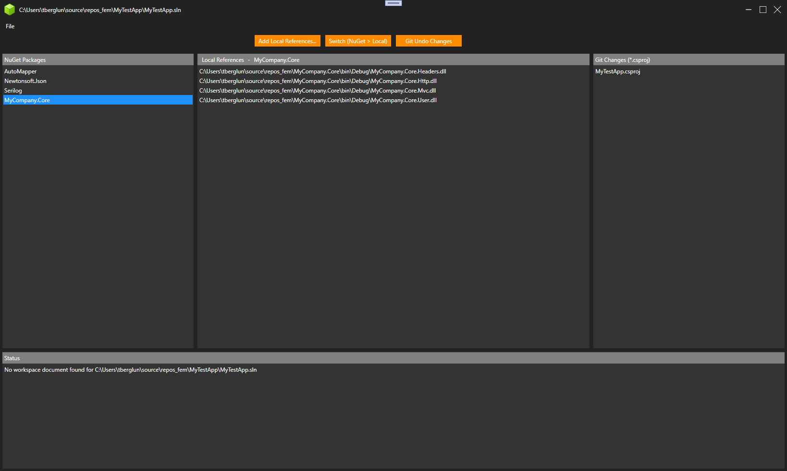

# NuGetSwitch

**NuGetSwitch** is a standalone utility that allows you to switch from NuGet package  
references to local assembly references.

---

## How to Use

1. Open a Visual Studio solution file.
2. Select the NuGet package you want to replace.
3. Browse and select the corresponding local assemblies.
4. Click **Switch**.

Visual Studio will now use the specified local assemblies instead of the NuGet package  
to build the solution.

If a Git repository is detected, the utility will provide an option to undo the changes.

---

## How to Build

The utility was built using Visual Studio 2022 and .NET 9 with WPF enabled.

---

## How it Works

The utility works by parsing `.sln` and `.csproj` files, then modifying the `.csproj` files by  
replacing NuGet package references with local assembly references.

When exiting the application, a file is created alongside the solution file. This file stores  
the local assembly selections for each package, enabling automatic reuse in future sessions.
